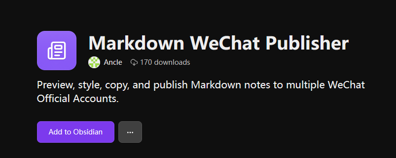
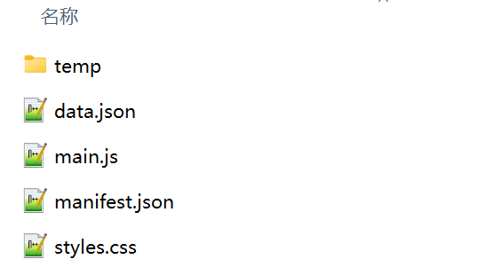
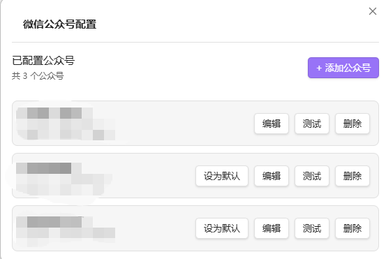
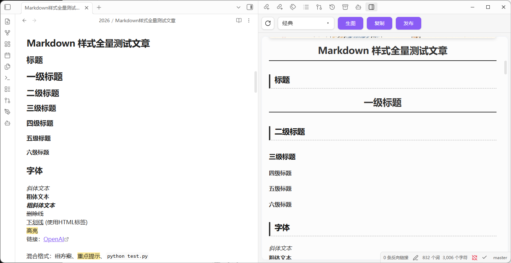

# Markdown WeChat Publisher

Preview, style, copy, and publish Markdown notes from Obsidian to WeChat Official Accounts.

[中文文档](README.md)

## Features

- Publish local Obsidian notes to WeChat: preview Markdown formatting in Obsidian, copy rendered content to the WeChat editor, or publish notes to the WeChat draft box.
- Visual style editor: use built-in article themes and adjust headings, paragraphs, quotes, code blocks, images, tables, and other styles.
- Multiple WeChat Official Accounts: configure multiple accounts and choose the target account before publishing.
- APIMart image generation: generate article images from fixed `image-prompt` comments, save the images locally, and replace the prompts in the article.

## Installation

### Install from the community plugin marketplace

1. Open Obsidian settings.
2. Go to `Community plugins` and turn off restricted mode.
3. Click `Browse` and search for `Markdown WeChat Publisher`.
4. Install and enable the plugin.

Plugin marketplace page:
[Markdown WeChat Publisher](https://community.obsidian.md/plugins/markdown-wechat-publisher)



### Manual installation

1. Download the latest release files:
   - `main.js`
   - `manifest.json`
   - `styles.css`
2. Create this folder in your vault:

   ```text
   .obsidian/plugins/markdown-wechat-publisher
   ```

   

3. Put the three files into that folder.
4. Restart Obsidian.
5. Enable `Markdown WeChat Publisher` in `Settings > Community plugins`.

## Setup

Open `Settings > Markdown WeChat Publisher` and add a WeChat Official Account.

Each account requires:

- Account name
- App ID
- App secret

You can test the connection after entering the account credentials.



### Image generation

The plugin can generate images from fixed prompt comments in Markdown:

```markdown
<!-- image-prompt: A clean blue technology cover image for a WeChat article -->
```

Configure the image generation API URL, API key, model, aspect ratio, resolution, timeout, and polling interval in plugin settings.

## Usage

1. Open a Markdown note.
2. Open the plugin preview from the ribbon icon, or press `Ctrl+P` and search for `Markdown WeChat Publisher` in the command palette.
3. Choose a theme and check the preview.
4. Generate article images when the note contains `image-prompt` comments.
5. Copy the rendered content to the WeChat editor, or publish it to the WeChat draft box.

## Screenshots



## Privacy

Account credentials and plugin settings are stored in the current Obsidian vault.

When publishing, the plugin connects to the configured WeChat Official Account API to fetch access tokens, upload images, and create drafts.

When image generation is enabled, image prompts are sent to the configured image generation API.

The plugin does not send article content to other third-party services unless you explicitly configure and use those services.

## Development

```bash
npm install
npm run build
```

## License

AGPL-3.0
